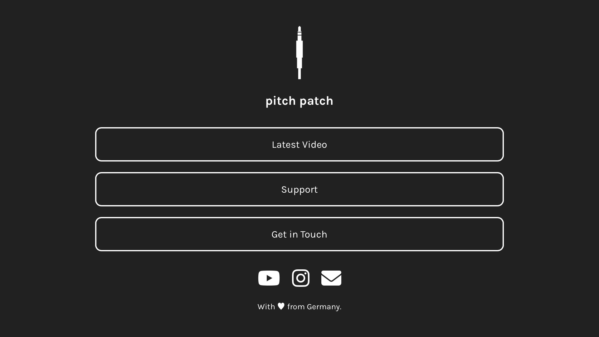

<h1 align="center">Linktree</h1>
<h3 align="center">A lightweight and unbranded social media reference landing page.</h3>

<p align="center">
  
  
  
  
  <a href="https://github.com/pitch-patch/linktree/commits/simplified">
    </a>
</p>

<p align="center">
  <a href="#about">About</a>&nbsp;&nbsp;&nbsp;|&nbsp;&nbsp;&nbsp;
  <a href="#get-started">Get Started</a>&nbsp;&nbsp;&nbsp;|&nbsp;&nbsp;&nbsp;
  <a href="#contribute">Contribute</a>&nbsp;&nbsp;&nbsp;|&nbsp;&nbsp;&nbsp;
  <a href="#license">License</a>
</p>

---

<p align="center">
  
</p>

---

## About

This is an open-source social media reference landing page (e.g. alternative to Linktree).
- [Demo](https://pitch-patch.github.io/linktree)

## Get Started

Download the [ZIP file](https://github.com/pitch-patch/linktree/archive/refs/heads/simplified.zip) or run the following [git](https://git-scm.com/downloads) command to clone the files and edit `index.html` and `style.css` to your liking. If you want to track the performance of your links, use shortlinks (e.g. [short.io](https://short.io)).
```bash
git clone https://github.com/pitch-patch/linktree
```

## Contribute

- Fork this repository
- Create a branch with your feature: `git checkout -b my-feature`
- Commit your changes: `git commit -m "feat: my new feature"`
- Push to your branch: `git push origin my-feature`

Once your pull request has been merged, you can delete your branch.

## License

Licensed under the [MIT](LICENSE.md) license.

---

Forked with ♡ by pitch patch. [Get in touch](https://pitch-patch.github.io/linktree).
